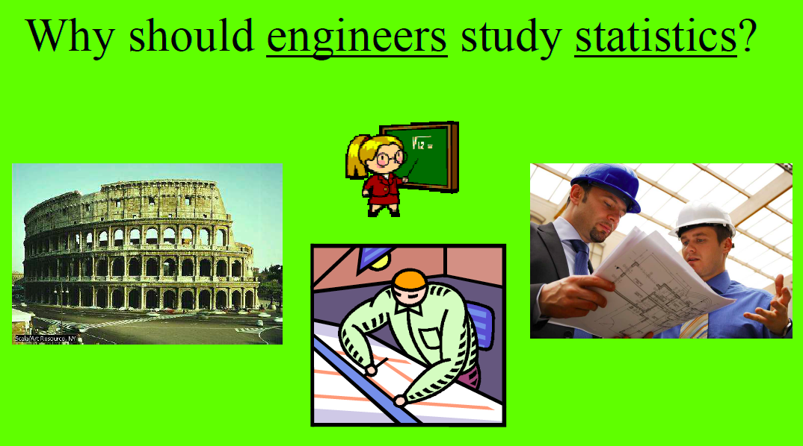

```{r setup}
#| include: false
knitr::opts_chunk$set(
  collapse = TRUE, 
  warning = FALSE,
  message = FALSE,
  error = TRUE,
  fig.height = 2.75, 
  fig.width = 4.25,
  fig.env = 'figure',
  fig.pos = 'h',
  fig.align = 'center')
```


# Resources

## Course Website {-}

::: {.incremental}
- The **Course Website** will serve as the **main hub for this course**.

- **Class Activities:** Lecture notes, handouts, examples, and other class resources will be posted under the **Activities** tab.
  - I will continue adding materials to each unit as we progress through the course.
  - Once a unit is completed, we will move on to the next unit.
  
:::


::: {.content-visible when-format="pptx"}

---

:::

::: {.incremental}
- The Course Website will also provide easy access to:
  - **Practice Problems (PP)**
  - **Homework Assignments (HW)**
  - **Live Course Schedule**
  - **R Resources**
  - **Course Syllabus**
  
:::

::: {.content-visible when-format="pptx"}

---

:::

::: {.incremental}
- **Canvas** will primarily be used for:
  - Taking quizzes
  - Submitting HW assignments
  - Viewing Practice Problem solutions
  - Accessing/downloading the course textbook and other restricted course materials
  - Course announcements and discussions

:::


::: {.content-visible when-format="pptx"}

::: {.notes}

1. I assume you have gone through the syllabus, participated in the Special Quiz, if not do this by next class
2. We will visit the syllabus and course rules later when needed

:::

:::


## Class Notes vs Slides {-}

::: {.incremental}

- **Slides are generated automatically** from the Activities posted on the course website. 

- During class, we will focus primarily on **live note-taking** rather than simply reading from slides.

- Please watch for my email after each class for the corresponding **electronic class notes**.

:::

::: {.content-visible when-format="pptx"}

::: {.notes}

1. You can download the PP version directly from the course website

:::

:::


::: {.content-visible when-format="pptx"}

---

:::


::: {.incremental}

- Live note-taking will generally have two parts:

  1. **Notes on a blank page:**  
     We will write down important definitions, concepts, theories, formulas, and other key ideas discussed during class.

  2. **Notes on the handouts:**  
     The handouts contain examples and exercises that apply the concepts and theories we have just discussed. We will work through these together during class.

:::


## Handouts {-}

::: {.incremental}

- Download the [Unit 02A Handout: Visualization](/handout/Unit-02_A_Handout.pdf) before class and bring it with you.

- I will continue to post additional handouts as we progress through the course. Please watch for **Canvas Announcements** when a new handout becomes available.

- It is very important that you **bring the appropriate handout to class regularly**, either as a printed copy or on your writing device.

:::


## Practice Problems {-}

::: {.incremental}

- **Practice Problems (PP)** are essential for strengthening your understanding, building confidence, and exploring the concepts covered in class.

- The **Unit 02 Practice Problems** are available under the **Practice Problems** tab on the course website.

- Complete the relevant Practice Problems as we progress through the unit.

- Make sure you have completed and reviewed the Unit 02 Practice Problems **before attempting the corresponding HW assignment**.

:::


## R & RStudio {-}

"Doing" statistical modeling and working with data in general requires statistical software. Calculators and spreadsheet functionality alone do not cut it.

We will use **R** and **RStudio** throughout the course.

```{r echo = FALSE, fig.cap = "Figure 1.1 from [A ModernDive into R and the Tidyverse](https://moderndive.com/1-getting-started.html)."}
knitr::include_graphics("../images/r_vs_rstudio.png")
```


::: {.content-visible when-format="pptx"}

---

:::


::: {.incremental}

- Download and install **R** and **RStudio** on your device by the end of this week.

- Check the **R Resources** tab on the course website for detailed installation instructions.

- If you encounter problems during the installation process, you may use **AI tools** to help troubleshoot the issue.

- If you are still unable to complete the installation, please bring your device to class or office hours so we can troubleshoot it together.

:::


## Communcation {-}


- Syllabus


# Why Engineers Need Statistics {-}


## Why should engineers study statistics? {-}

```{r echo = FALSE}

```


## What is statistics? {-}

**Statistics** is the science of **collecting, analyzing, and interpreting data**.

::: {.incremental}

- Engineers collect data from experiments, manufacturing processes, and systems.

- Engineers analyze data to understand patterns and relationships.

- Engineers interpret data to make decisions and improve processes.

:::


## Example: Manufacturing bolts {-}

A factory is manufacturing bolts that should be exactly **2 inches long**.

::: {.incremental}

- Measuring the length of **all** bolts (a census) may be:
    - too time consuming,
    - too expensive,
    - or impossible.

- Instead, we can collect a **sample** of bolts.

:::


## Population and sample {-}

A random sample of 5 bolts yields the following measurements, in inches:

\[
\{2.003, 1.999, 2.006, 1.996, 2.001\}
\]


::: {.incremental}

**Population:** The set of all people or things being studied, i.e., all possible observations.


**Sample:** The subset of the population from which information is actually collected.

:::


## Variability {-}

Consider again the measurements:

\[
\{2.003, 1.999, 2.006, 1.996, 2.001\}
\]

The data have **variability**.


::: {.incremental}

- Identify the source(s) of the variation.

- Reduce the variation.

:::


## Additional information: Machines {-}

The bolts are being produced by two different machines:

::: {.incremental}

- **Machine A**

- **Machine B**

:::


This gives us one possible source of variation in bolt length.


## Additional information: Production speed {-}

Each machine has three speed settings:

::: {.incremental}

- **Slow:** 500 bolts/minute

- **Medium:** 1000 bolts/minute

- **Fast:** 2000 bolts/minute

:::


Now we have two possible sources of variation:

::: {.incremental}

1. Machine

2. Production speed

:::


## How should we collect the data? {-}

There are several options.

::: {.incremental}

- **Retrospective Study**

  Use data that have been collected in the past.


- **Observational Study**

  Observe the process in the present and collect data.


- **Designed Experiment**

  Exhibit maximum control over **when, where, and how** the data are collected.

:::
