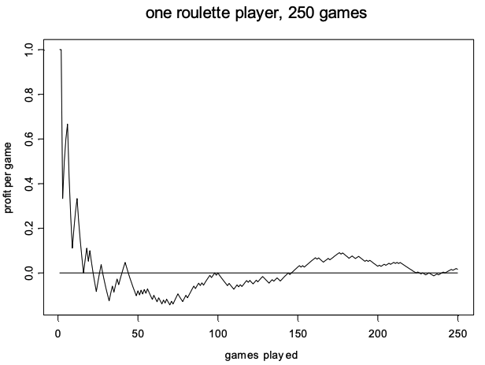
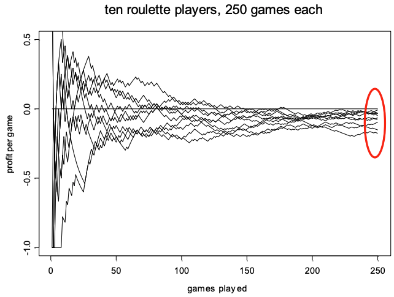

```{r setup}
#| include: false
knitr::opts_chunk$set(
  collapse = TRUE, 
  warning = FALSE,
  message = FALSE,
  error = TRUE,
  fig.height = 2.75, 
  fig.width = 4.25,
  fig.env = 'figure',
  fig.pos = 'h',
  fig.align = 'center')
```


# Resources


## Handouts {-}

::: {.incremental}

- Download the [Unit 04 Handout: Probability](/handout/Unit-04-Discrete.pdf) before class and bring it with you.

- I will continue to post additional handouts as we progress through the course. Please watch for **Canvas Announcements** when a new handout becomes available.

- It is very important that you **bring the appropriate handout to class regularly**, either as a printed copy or on your writing device.

:::


## Practice Problems {-}

::: {.incremental}

- **Practice Problems (PP)** are essential for strengthening your understanding, building confidence, and exploring the concepts covered in class.

- The **Unit 03 Practice Problems** are available under the **Practice Problems** tab on the course website. The solutions are provided in Canvas.

- Complete the relevant Practice Problems as we progress through the unit.

- Make sure you have completed and reviewed the Practice Problems **before attempting the corresponding HW assignment**.

:::


# Discrete Random Variable


## Class Notes {-}

- Live class lecture notes
- I usually post the class notes on Canvas by the end of the day. If you don't see it, shoot me an email next day!


## Proof: Expected Value of Linear Transformation {-}

::: {.incremental}

- Let $a$ and $b$ be constants.

- We want to show that

$$
E(aX+b)=aE(X)+b.
$$

- Start from the definition of expected value:

$$
E(aX+b)
=
\sum (ax+b)p(x).
$$

- Distribute inside the summation:

$$
E(aX+b)
=
\sum axp(x)
+
\sum bp(x).
$$

- Since $a$ and $b$ are constants, they can be taken outside the summations:

$$
E(aX+b)
=
a\sum xp(x)
+
b\sum p(x).
$$

- Recall that

$$
\sum xp(x)=E(X)
$$

and

$$
\sum p(x)=1.
$$

- Therefore,

$$
E(aX+b)
=
aE(X)+b(1).
$$

- Hence,

$$
\boxed{
E(aX+b)=aE(X)+b
}
$$

:::

## Variance of a Discrete Random Variable{-}

::: {.incremental}

- Recall that the variance of a discrete random variable $X$ is

$$
V(X)
=
\sum (x-\mu)^2 P(X=x).
$$

- Since

$$
P(X=x)=p(x),
$$

we can write

$$
V(X)
=
\sum (x-\mu)^2 p(x).
$$

- Expand the squared term:

$$
V(X)
=
\sum (x^2-2\mu x+\mu^2)p(x).
$$

- Distribute $f(x)$:

$$
V(X)
=
\sum x^2 p(x)
-
2\mu \sum x p(x)
+
\mu^2 \sum p(x).
$$

- Recall that

$$
\sum x p(x)=E(X)=\mu
$$

and

$$
\sum p(x)=1.
$$

- Therefore,

$$
V(X)
=
\sum x^2 p(x)
-
2\mu(\mu)
+
\mu^2(1).
$$

- Hence,

$$
V(X)
=
\sum x^2 p(x)-\mu^2.
$$

- Since

$$
E(X^2)=\sum x^2 p(x),
$$

we obtain the useful variance formula

$$
\boxed{
V(X)=E(X^2)-[E(X)]^2
}
$$

:::


## Proof: Variance of a Linear Transformation {-}

::: {.incremental}

- We want to show that

$$
V(aX+b)=a^2V(X).
$$

- By the definition of variance,

$$
V(aX+b)
=
\sum
\left[
(ax+b)-E(aX+b)
\right]^2
p(x).
$$

- Using

$$
E(aX+b)=aE(X)+b,
$$

we get

$$
V(aX+b)
=
\sum
\left[
ax+b-aE(X)-b
\right]^2
p(x).
$$

- Simplifying,

$$
V(aX+b)
=
\sum
\left[
ax-aE(X)
\right]^2
p(x).
$$

- Factor out $a$:

$$
V(aX+b)
=
\sum
\left[
a(x-E(X))
\right]^2
p(x).
$$

- Therefore,

$$
V(aX+b)
=
\sum
a^2
\left[
x-E(X)
\right]^2
p(x).
$$

- Since $a^2$ is a constant,

$$
V(aX+b)
=
a^2
\sum
\left[
x-E(X)
\right]^2
p(x).
$$

- But

$$
\sum
\left[
x-E(X)
\right]^2
p(x)
=
V(X).
$$

- Hence,

$$
\boxed{
V(aX+b)=a^2V(X)
}
$$

- The other two properties are special cases:

$$
V(aX)=a^2V(X)
$$

when $b=0$, and

$$
V(X+b)=V(X)
$$

when $a=1$.

:::


## Simulating Roulette!


```{r echo = FALSE, fig.cap = "One Player - 250 Games."}

```

```{r echo = FALSE, fig.cap = "Ten Players - 250 Games."}

```


## Bernoulli Distribution {-}

### Idea {-}

::: {.incremental}

- A **Bernoulli experiment** has exactly two possible outcomes.

- One outcome is called **success**, and the other is called **failure**.

  - For example, we can define “rolling a six” as a **success**.

  - We can define “an item is defective” as a **success**.

- Let $p$ be the probability that the experiment results in a success.

- Define the discrete random variable

$$
X=
\begin{cases}
1, & \text{if the experiment is a success},\\
0, & \text{if the experiment is a failure}.
\end{cases}
$$

- Then

$$
P(X=1)=p
$$

and

$$
P(X=0)=1-p.
$$

- Therefore, the probability mass function (PMF) of $X$ is

$$
p(x)=
\begin{cases}
p, & x=1,\\
1-p, & x=0.
\end{cases}
$$

:::


### Formula {-}

::: {.incremental}

- A discrete random variable $X$ has the **Bernoulli distribution** with parameter $p$ (A parameter is a fixed number that describes or controls a probability distribution) if

$$
P(X=1)=p
$$

and

$$
P(X=0)=1-p.
$$

- The probability mass function (PMF) of $X$ is

$$
p(x)=
\begin{cases}
p, & x=1,\\
1-p, & x=0.
\end{cases}
$$

- Equivalently,

$$
p(x)=p^x(1-p)^{1-x},
\qquad x=0,1.
$$

- The parameter $p$ can be any number between $0$ and $1$.

- The mean and variance are

$$
E(X)=p
$$

and

$$
V(X)=p(1-p).
$$

:::


### Bernoulli Trials {-}

::: {.incremental}

- A sequence of **independent Bernoulli experiments** with the same probability of success $p$ is called a sequence of **Bernoulli trials**.

- **Examples:**

  - Tossing a coin 10 times.

  - Rolling a die 8 times and recording each time whether we get a six.

  - Inspecting 50 manufactured items for defects.

- With Bernoulli trials, we are usually interested in the **total number of successes**.

- For example:

  - Out of 10 tosses, how many heads did we get?

  - How many sixes did we get in 8 rolls of a die?

  - Out of 50 manufactured items, how many are defective?

:::


### Bernoulli Trials: Example {-}

::: {.incremental}

- Suppose $n=5$ items are manufactured **independently** of each other.

- Define:

  - $B=$ success (defect)

  - $A=$ failure (no defect)

- Suppose the probability of a defect is

$$
p=0.05.
$$

- Let

$$
X_i=
\begin{cases}
1, & \text{if the }i\text{th item is defective},\\
0, & \text{otherwise}.
\end{cases}
$$

- Let

$$
Y=\text{total number of defects}.
$$

- Therefore,

$$
Y=X_1+X_2+X_3+X_4+X_5.
$$

- The possible values of $Y$ are

$$
Y=\{0,1,2,3,4,5\}.
$$

:::


### Bernoulli Trials: Possible Outcomes {-}

::: {.incremental}

- The table below shows all possible outcomes of the five Bernoulli trials and the corresponding value of $Y$.

| Outcome | $Y$ | Outcome | $Y$ |
|:-------:|:---:|:-------:|:---:|
| AAAAA | 0 | AAAAB | 1 |
| BAAAA | 1 | BAAAB | 2 |
| ABAAA | 1 | ABAAB | 2 |
| BBAAA | 2 | BBAAB | 3 |
| AABAA | 1 | AABAB | 2 |
| BABAA | 2 | BABAB | 3 |
| ABBAA | 2 | ABBAB | 3 |
| BBBAA | 3 | BBBAB | 4 |
| AAABA | 1 | AAABB | 2 |
| BAABA | 2 | BAABB | 3 |
| ABABA | 2 | ABABB | 3 |
| BBABA | 3 | BBABB | 4 |
| AABBA | 2 | AABBB | 3 |
| BABBA | 3 | BABBB | 4 |
| ABBBA | 3 | ABBBB | 4 |
| BBBBA | 4 | BBBBB | 5 |

:::


### Bernoulli Trials: Probability of an Outcome {-}

::: {.incremental}

- The Bernoulli random variables $X_i$ are **independent**.

- Therefore, using basic probability rules we get,

$$
\begin{aligned}
P(AABAB)
&= P(X_1=0 \text{ and } X_2=0 \text{ and } X_3=1 \text{ and } X_4=0 \text{ and } X_5=1) \\
&= P(X_1=0)P(X_2=0)P(X_3=1)P(X_4=0)P(X_5=1) \\
&= (0.95)(0.95)(0.05)(0.95)(0.05) \\
&= 0.05^2(0.95)^3.
\end{aligned}
$$

- Similarly,

$$
P(BAAAB)=0.05^2(0.95)^3.
$$

- Thus, the probability of **each particular outcome containing exactly 2 defects** is

$$
0.05^2(0.95)^3.
$$

:::


### Bernoulli Trials: Number of Outcomes {-}

::: {.incremental}

- We want to find

$$
P(Y=2).
$$

- Each particular outcome containing exactly 2 defects has probability

$$
0.05^2(0.95)^3.
$$

- Therefore,

$$
P(Y=2)
=
(\text{number of outcomes with 2 defects})
\times
0.05^2(0.95)^3.
$$

- How many different outcomes of 5 items contain exactly 2 defects?

$$
\binom{5}{2}
=
\frac{5!}{2!3!}
=
10.
$$

- Therefore,

$$
P(Y=2)
=
\binom{5}{2}(0.05)^2(0.95)^3.
$$

:::


### Bernoulli Trials Leading to ? {-}

::: {.incremental}

- We can group all possible outcomes of the Bernoulli trials according to the value of $Y$.

- The probability mass function of $Y$ is

$$
P(Y=0)
=
1(0.05)^0(0.95)^5,
$$

$$
P(Y=1)
=
5(0.05)^1(0.95)^4,
$$

$$
P(Y=2)
=
10(0.05)^2(0.95)^3,
$$

$$
P(Y=3)
=
10(0.05)^3(0.95)^2,
$$

$$
P(Y=4)
=
5(0.05)^4(0.95)^1,
$$

and

$$
P(Y=5)
=
1(0.05)^5(0.95)^0.
$$

- Therefore, the PMF of $Y$ can be written as

$$
P(Y=x)
=
\binom{5}{x}
(0.05)^x
(0.95)^{5-x},
\qquad
x=0,1,\ldots,5.
$$

- The distribution of $Y$ is called the **Binomial distribution**.

:::

## Hypergeometric Distribution {-}

::: {.incremental}

- A set of $N$ objects contains:
  - $K$ objects classified as **successes**
  - $N-K$ objects classified as **failures**

- A sample of size $n$ is selected randomly **without replacement** from the $N$ objects, where $K\leq N$ and $n\leq N$.

- Let the random variable $X$ denote the **number of successes in the sample**.

- Then $X$ is a hypergeometric random variable with probability mass function

$$
P(X=x)
=
\frac{\binom{K}{x}\binom{N-K}{n-x}}
{\binom{N}{n}},
$$

where

$$
x=\max(0,n+K-N),\ldots,\min(K,n).
$$

:::


## Hypergeometric Mean and Variance {-}

::: {.incremental}

- If $X$ is a hypergeometric random variable with parameters $N$, $K$, and $n$, then

$$
\mu=E(X)=np,
$$

and

$$
\sigma^2=V(X)
=
np(1-p)
\left(
\frac{N-n}{N-1}
\right),
$$

where

$$
p=\frac{K}{N}.
$$

- The quantity

$$
\frac{N-n}{N-1}
$$

is called the **finite population correction factor**.

- Therefore,

$$
\sigma
=
\sqrt{
np(1-p)
\left(
\frac{N-n}{N-1}
\right)
}.
$$

- As the sampling fraction $n/N$ becomes small, the hypergeometric variance approaches the corresponding **binomial variance**.

:::